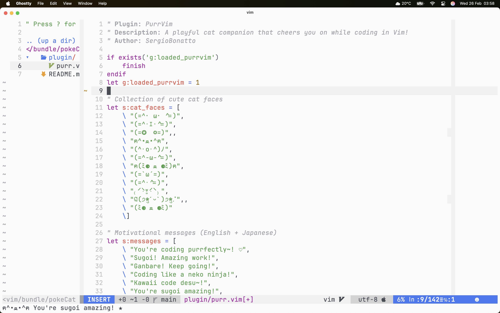

# PurrVim ฅ^•ﻌ•^ฅ ✨

*Nya~* ようこそ! Welcome to **PurrVim**, your fluffy neko companion for Vim! This *kawaii* plugin brings adorable *kao moji* and uplifting messages to give you that extra *ganbatte* while coding. Ready to make your terminal *kirakira* and full of love? Let's go! 🌸



## 🌟 What Makes It Kawaii? 🌟
🐱 **Neko faces:** Cute expressions like (=^・ω・^=) or ฅ(ﾐ⚈ ﻌ ⚈ﾐ)ฅ appear randomly to make you smile!
💌 **Encouraging messages:** "You're coding purrfectly! ♡" or "にゃんにゃん Keep going!" to warm your heart.
✨ **Subtle sparkles:** Just a little *hikari* to make coding more *tanoshii*!
😴 **Sleepy mode:** If you stop for too long, the neko gets *nemui* and asks, "More coding please~?"
🎀 **Customization:** Because even a *nyanko* knows your workflow is special!
⚡ **JoJo references:** Your coding gets PLUS ULTRA with motivational JoJo quotes like "ORA ORA ORA!" and "ZA WARUDO!"

## 🐾 How to Install This Neko? 🐾
So easy it's like a purr! Just clone the repo into your Vim:
```sh
git clone https://github.com/SergioBonatto/PurrVim.git ~/.vim/pack/plugins/start/PurrVim
```
Restart Vim and your neko will welcome you with a *"Nya~! ✧･ﾟ"*

## 🎀 How to Play with It? 🎀
- `:PurrVimCat` – Summon your neko for a motivational purr!
- `:PurrVimSparkle` – Activate *hikari mode* and sparkle up your code!

### Suggested Keybindings:
Want your neko always near? Add this to your `.vimrc`:
```vim
nnoremap <silent> <Leader>c :PurrVimCat<CR>
nnoremap <silent> <Leader>cs :PurrVimSparkle<CR>
```
(I use `\` as `<Leader>`, but feel free to customize, *nya~*!)

## 🌸 Kawaii Configurations 🌸
Your neko automatically appears when you're coding, but you can adjust its behavior:
```vim
" How often the neko appears (higher = less frequently)
let g:purrvim_frequency = 15

" Time in seconds before neko gets sleepy (default: 30)
let g:purrvim_sleepy_time = 30
```
Set the purring to your rhythm!

## 💞 Want to Help This Neko? 💞
Ideas to make **PurrVim** even more *sugoi*? Open an issue or send a PR on GitHub! Every bit of love makes this *nyanko* shine brighter!

## 📜 Kawaii License
PurrVim is under the MIT license. Feel free to use, modify, and spread the *neko love*!

May your code be as *subarashii* as a cat jumping into boxes! *Ganbatte, nya~!* ✿
